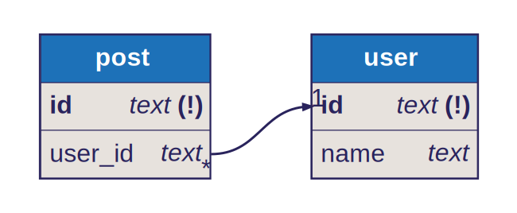

# Drizzle ERD

A super-simple way to generate Entity-Relationship Diagrams (ERDs) from your Drizzle schema. Use case (CLI or in-code) and dialect (PG, MySQL, SQLite) agnostic!

## COMING SOON!

Currently in-progress, but releasing shortly!

## Alpha usage

If you'd like to use this package right now, in lieu of any proper documentation, here's how to get started:

```jsonc
{
  //...Rest of package.json
  "scripts": {
    //...Other scripts
    "db:generate-erd": "drizzle-erd --in ./src/or/path/to/schema.ts --out erd.svg"
  }
}
```

You basically just call the `drizzle-erd` binary / CLI tool with two arguments for now:

- `--in` :: the path to your TS schema file
- `--out` :: what you want your SVG to be called

### Add your ERD to your README

Add your ERD to your readme like this:

```md

```


### Make it all automatic

Call the `db:generate-erd` script you defined earlier from a Git `pre-commit` hook to make sure your generated ERD is always up-to-date (especially if you're printing it out to your README as above).
